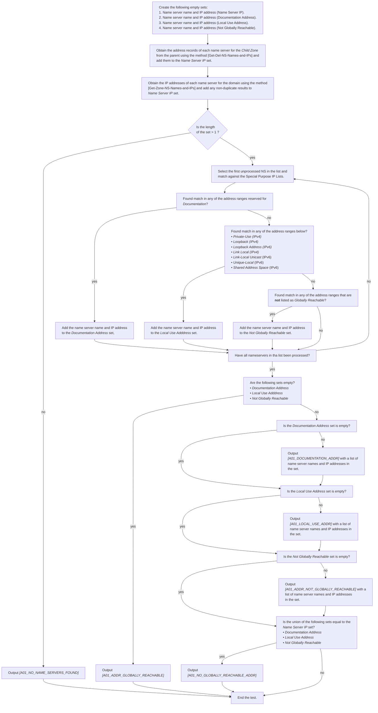

# ADDRESS01: Name server address must be globally reachable

## Test case identifier
**ADDRESS01** 

## Table of contents

* [Objective](#Objective)
* [Scope](#Scope)
* [Inputs](#Inputs)
* [Summary](#Summary)
* [Test procedure](#Test-procedure)
* [Outcome(s)](#Outcomes)
* [Intercase dependencies](#Intercase-dependencies)

## Objective

In order for the domain and its resources to be accessible, authoritative 
name servers must have addresses in the routable public addressing space.

IANA is responsible for global coordination of the IP addressing system.
Aside its address allocation activities, it maintains reserved address ranges
for special uses. These ranges can be categorized into two types: 
[Special purpose IPv4 addresses] and [Special purpose IPv6 addresses].

This test checks the name server IP addresses, both those derived from delegation and those 
derived from the name servers listed in the zone (NS records). Each address is compared against
the IANA databases. If an address is not globally routable, a message is outputted.

## Scope

This test case does not do any  actual connectivity test, which is done by other test cases.

## Inputs

* "Child Zone" -- the domain name to be tested.

## Summary

Message Tag                       | Level    | Arguments | Message ID for message tag
:-------------------------------- |:---------|:----------|:--------------------------
A01_ADDR_GLOBALLY_REACHABLE       | INFO     |           | All IP addresses of all name servers are listed as in the globally reachable address space.
A01_NO_NAME_SERVERS_FOUND         | CRITICAL |           | No name servers found.
A01_NO_GLOBALLY_REACHABLE_ADDR    | ERROR    |           | None of the name servers IP addresses are listed as globally reachable.
A01_ADDR_NOT_GLOBALLY_REACHABLE   | ERROR    | ns_list   | IP address not listed as globally reachable "{ns_list}".
A01_DOCUMENTATION_ADDR            | ERROR    | ns_list   | IP address intended for documentation purposes "{ns_list}".
A01_LOCAL_USE_ADDR                | ERROR    | ns_list   | IP address intended for local use on network or service provider level "{ns_list}". 

The value in the Level column is the default severity level of the message. The
severity level can be changed in the [Zonemaster-Engine profile]. Also see the
[Severity Level Definitions] document.

The argument names in the Arguments column lists the arguments used in the
message. The argument names are defined in the [Argument list].

## Test procedure 

1. Create the following empty sets:
   1. Name server name and IP address ("Name Server IP").
   2. Name server name and IP address ("Documentation Address").
   3. Name server name and IP address ("Local Use Address").
   4. Name server name and IP address ("Not Globally Reachable").

2. Obtain the address records of each name server for the *Child Zone* from the
   parent using the method [Get-Del-NS-Names-and-IPs] and add them to the 
   *Name Server IP* set. 

3. Obtain the IP addresses of each name server for the domain using the method 
   [Get-Zone-NS-Names-and-IPs] and add any non-duplicate results to 
   *Name Server IP* set. 

4. If the *Name Server IP* set is empty, output *[A01_NO_NAME_SERVERS_FOUND]*
   and exit the test.

5. For each name server in *Name Server IP* do:
   1. Match the IP address against the IP ranges specified in 
      [Special purpose IPv4 addresses] and [Special purpose IPv6 addresses]
      1. If if falls within any of the address ranges reserved for 
        *Documentation*, add the name server name and IP address to the
        *Documentation Address* set,
      2. Else, if it falls within an address range belonging to any of the 
         following categories:  
         - *Private-Use (IPv4)*
         - *Loopback (IPv4)*
         - *Loopback Address (IPv6)*
         - *Link Local (IPv4)*
         - *Link-Local Unicast* (IPv6)
         - *Unique-Local* (IPv6)
         - *Shared Address Space* (IPv6)
         add the name server name and IP address to the *Local Use Adddress* 
         set. 
      3. Else, if the IP falls within any other range that is not registered as 
         *Globally Reachable*, add the name server name and IP address to 
         the *Not Globally Reachable* set.
   2. Go to the next server.
6. If the sets *Documentation Address*, *Local Use Adddress* and 
   *Not Globally Reachable* are all empty, then output 
   *[A01_ADDR_GLOBALLY_REACHABLE]*
7. If the *Documentation Address* set is non-empty, then output 
   *[A01_DOCUMENTATION_ADDR]* with a list of name server names and IP addresses
   from the set.
8. If the *Local Use Address* set is non-empty, then output 
   *[A01_LOCAL_USE_ADDR]* with a list of name server names and IP addresses
   from the set.
9. If the *Not Globally Reachable* set is non-empty, then output 
    *[A01_ADDR_NOT_GLOBALLY_REACHABLE]* with a list of name server names and 
    IP addresses from the set.
10. If the union of the *Documentation Address*, *Local Use Address* and 
    *Not Globally Reachable* sets is equal to the *Name Server IP* set,
    then output *[A01_NO_GLOBALLY_REACHABLE_ADDR]* 

  
## Outcome(s)

The outcome of this Test Case is "fail" if there is at least one message
with the severity level *[ERROR]* or *[CRITICAL]*.

The outcome of this Test Case is "warning" if there is at least one message
with the severity level *[WARNING]*, but no message with severity level 
*[ERROR]* or *[CRITICAL]*.

In other cases, no message or only messages with severity level
*[INFO]* or *[NOTICE]* the outcome of this Test Case is "pass".

## Special procedural requirements

The registries [Special purpose IPv4 addresses] and 
[Special purpose IPv6 addresses] have to be fetched prior to testing.

## Intercase dependencies

None.

 
[A01_ADDR_GLOBALLY_REACHABLE]:      #summary 
[A01_NO_GLOBALLY_REACHABLE_ADDR]:   #summary 
[A01_ADDR_NOT_GLOBALLY_REACHABLE]:  #summary 
[A01_DOCUMENTATION_ADDR]:           #summary 
[A01_LOCAL_USE_ADDR]:               #summary 
[A01_NO_NAME_SERVERS_FOUND]:        #summary
[Argument list]:                    ../ArgumentsForTestCaseMessages.md
[CRITICAL]:                         ../SeverityLevelDefinitions.md#critical
[ERROR]:                            ../SeverityLevelDefinitions.md#error
[Get-Del-NS-Names-and-IPs]:         ../MethodsV2.md#method-get-delegation-ns-names-and-ip-addresses
[Get-Zone-NS-Names-and-IPs]:        ../MethodsV2.md#method-get-zone-ns-names-and-ip-addresses
[INFO]:                             ../SeverityLevelDefinitions.md#info
[NOTICE]:                             ../SeverityLevelDefinitions.md#notice
[Special purpose IPv4 addresses]:   https://www.iana.org/assignments/iana-ipv4-special-registry/iana-ipv4-special-registry.xml 
[Special purpose IPv6 addresses]:   https://www.iana.org/assignments/iana-ipv6-special-registry/iana-ipv6-special-registry.xml
[Severity Level Definitions]:       ../SeverityLevelDefinitions.md
[WARNING]:                          ../SeverityLevelDefinitions.md#warning
[Zonemaster-Engine profile]:        ../../../configuration/profiles.md
